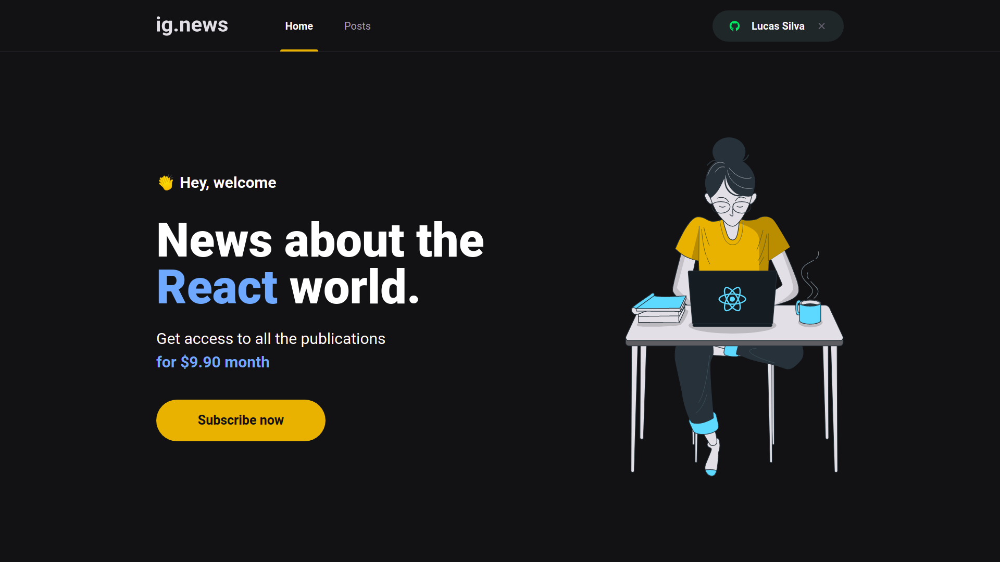
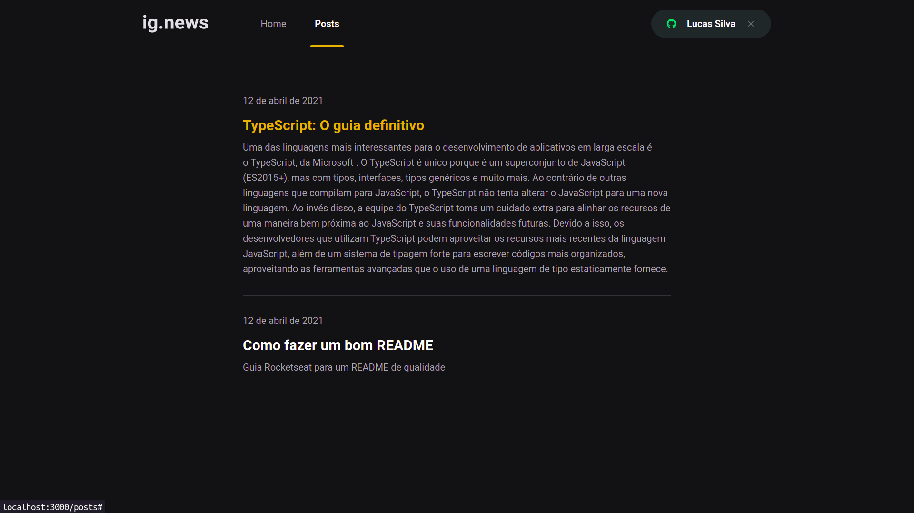

# Ignite Next.Js

    

  ---

  

### Sobre

O ignews é um blog de notícias super performático e com as tecnologias mais atuais do mercado. Ele é uma aplicação web do tipo Serveless.

---

### Tecnologias Usadas

- Typescript
- Next.js
- React.Js
- SASS
- Prismic
- Stripe
- FaunaDB
- Axios
